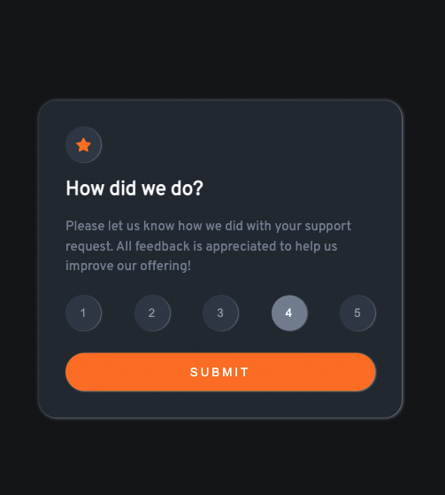

# Frontend Mentor - Interactive rating component solution

This is a solution to the [Interactive rating component challenge on Frontend Mentor](https://www.frontendmentor.io/challenges/interactive-rating-component-koxpeBUmI). Frontend Mentor challenges help you improve your coding skills by building realistic projects.

## Table of contents

- [Overview](#overview)
  - [The challenge](#the-challenge)
  - [Screenshot](#screenshot)
  - [Links](#links)
- [My process](#my-process)
  - [Built with](#built-with)
  - [What I learned](#what-i-learned)
  - [Continued development](#continued-development)
  - [Useful resources](#useful-resources)
- [Author](#author)
- [Acknowledgments](#acknowledgments)

## Overview

### The challenge

Users should be able to:

- View the optimal layout for the app depending on their device's screen size
- See hover states for all interactive elements on the page
- Select and submit a number rating
- See the "Thank you" card state after submitting a rating

### Screenshot

Desktop version


Rating hover effect


Rating active effect


Submit button effect


Thank you result


Mobile version


### Links

- Solution URL: (https://github.com/ponhuang/interactive-rating-component)
- Live Site URL: (https://ponhuang.github.io/interactive-rating-component/)

## My process

### Built with

- Semantic HTML5 markup
- SCSS custom properties
- Flexbox
- Mobile-first workflow
- JavaScript interactive function

### What I learned

- Adding rating value aftern user select the value.
  In the beginning, I was overthinking the solution, I checked other's solution, then found out it is quite easy, just using another variable and save the innerText.

```js
let rating = "";

for (let i = 0; i < value.length; i++) {
  value[i].addEventListener("click", function () {
    rating = this.innerText;
    return;
  });
}

document.querySelector(
  ".thanks__selected"
).textContent = `You selected ${rating} out of 5`;
```

### Continued development

There is one other thing haven't been solved yet:
when click the rating value, Javascript toggle the "active" class but didn't apply the property.
Also, it should just effect to single rating value when user click it. In this 1st version, if user click 4 in the first time, second time, he click 2, both buttons add "active" class.

I have no idea how to solve this yet, maybe this is beyond what I have learned so far. But I would definitely love to know the solution. If you have idea and would love to share with me, I would be appriate that. :)

## Author

Pon Huang

- Instagram - [Pon Huang](https://www.instagram.com/ponhuang/)
- Art Blog - [une felt](https://une722.wordpress.com)
